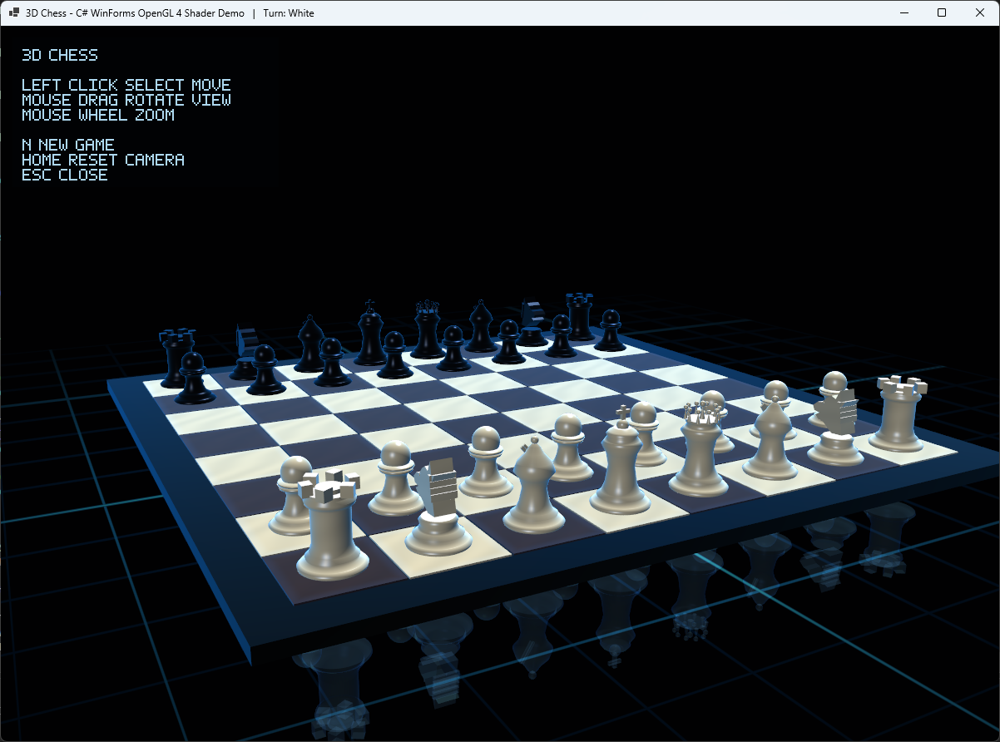

# 3D Chess — C# WinForms OpenGL 4

A small 3D chess pet project written in C# using WinForms and raw OpenGL 4.

The project renders a 3D chess board with OBJ-based chess pieces, GLSL shaders, lighting, reflections and mouse interaction. It is not based on a game engine or a 3D framework — the rendering pipeline, model loading, camera control and board interaction are implemented manually.



## Features

- 3D chess board rendered with OpenGL 4
- Chess pieces loaded from `.obj` models
- GLSL shader-based rendering
- Basic lighting and glossy material look
- Camera rotation with the mouse
- Mouse picking for selecting pieces and board squares
- Highlighting of selected pieces and possible moves
- Basic playable chess logic
- WinForms window and input handling
- No external graphics/game engine

## Controls

| Action | Control |
|---|---|
| Select piece / move | Left mouse click |
| Rotate camera | Hold and drag mouse |
| Zoom | Mouse wheel |
| New game | `N` |
| Reset camera | `Home` |
| Close | `Esc` |

## Technical details

The goal of this project was not to build a full chess engine, but to combine several low-level graphics and interaction systems in one understandable C# project:

- OpenGL initialization from WinForms
- GLSL shader compilation and linking
- OBJ model loading
- 3D camera and projection matrices
- Rendering of multiple mesh instances
- Mouse ray picking
- Board state management
- Basic move validation
- Visual feedback for interaction

## Requirements

- Windows
- .NET SDK with WinForms support
- GPU/driver with OpenGL 4 support
- Visual Studio or `dotnet` CLI

## Running

Open the project in Visual Studio and run it, or use the .NET CLI from the project directory:

```bash
dotnet run
```

## Project structure

Typical structure:

```text
.
├── Models/
│   ├── pawn.obj
│   ├── rook.obj
│   ├── knight.obj
│   ├── bishop.obj
│   ├── queen.obj
│   └── king.obj
├── Shaders/
│   ├── chess.vert
│   └── chess.frag
├── screenshot.png
└── *.cs
```

The exact filenames may differ depending on how the project is organized, but the idea is simple: C# code handles the application, OpenGL renders the scene, shaders define the visual style, and OBJ files provide the chess piece geometry.

## Notes

This is a graphics programming experiment, not a production chess application. Some advanced chess rules or engine-level features may be intentionally simplified.

The interesting part of the project is the rendering and interaction pipeline: drawing a complete 3D scene, selecting pieces with the mouse, loading models, working with shaders and keeping the board state synchronized with what is shown on screen.

## License

MIT License, or replace this section with your preferred license.

## Support

If you found this project interesting or useful, you can support my work:

[](https://github.com/sponsors/makarov-mm)